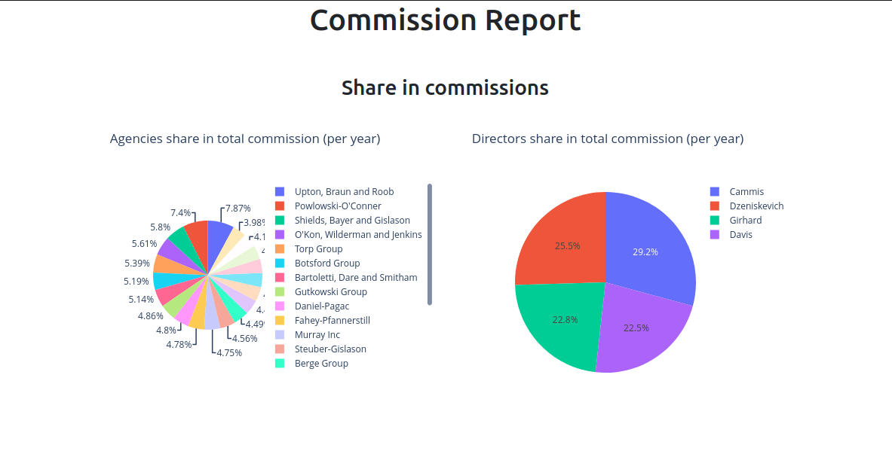
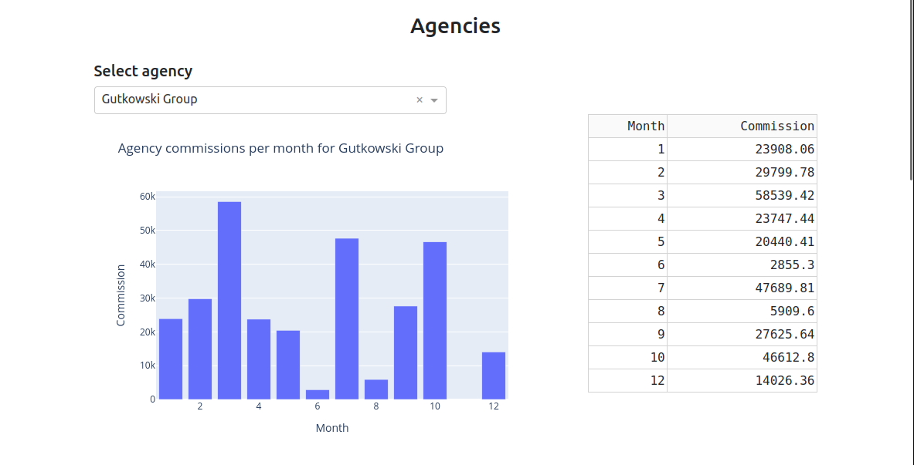
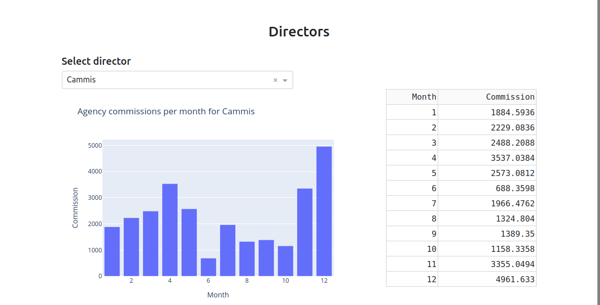

# Commission Report app

Create commission report for directors and sales representatives from database using Dash.

The Commission Report Project is an application that automates the process of calculating and visualizing monthly commissions for agencies and their directors. It uses a PostgreSQL database to store the data required for calculations. Based on this data, queries are generated, and the results are presented as interactive charts and tables using Dash. The project was inspired by prior professional experience, where a lack of automation significantly hindered similar analyses. This application makes the process faster, more transparent, and fully automated. Currently, this is an initial version of the application, which will be expanded with additional features in the future.

## Get Started
To properly run the application, you need a Python instlled and PostgreSQL database set up with the following specifications:

### Database Structure

The database should include the following tables:

### directors
| directorid | directorfirstname | directorlastname | directorhiredate |
|------------|-------------------|------------------|------------------|
- **directorid** – primary key, unique identifier for the director (*integer, auto-generated*),
- **directorfirstname** – first name of the director (*text, up to 255 characters*),
- **directorlastname** – last name of the director (*text, up to 255 characters*),
- **directorhiredate** – the hire date of the director (*date*).

### agencies
| agencyid | agencyname | directorid | ownerfirstname | ownerlastname | agencyhiredate |
|----------|------------|------------|----------------|---------------|----------------|
- **agencyid** – primary key, unique identifier for the agency (*integer, auto-generated*),
- **agencyname** – the name of the agency (*text, up to 255 characters*),
- **directorid** – identifier of the managing director for the agency (*foreign key referencing the directors table*),
- **ownerfirstname** – the first name of the agency owner (*text, up to 255 characters*),
- **ownerlastname** – the last name of the agency owner (*text, up to 255 characters*),
- **agencyhiredate** – the hire date of the agency (*date*).

### salesRepresentatives
| salesrepresentativeid | salesrepresentativefirstname | salesrepresentativelastname | agencyid |
|-----------------------|------------------------------|-----------------------------|----------|
- **salesrepresentativeid** – primary key, unique identifier for the sales representative (*integer, auto-generated*),
- **salesrepresentativefirstname** – first name of the sales representative (*text, up to 255 characters*),
- **salesrepresentativelastname** – last name of the sales representative (*text, up to 255 characters*),
- **agencyid** – identifier of the agency the sales representative works for (*foreign key referencing the agencies table*).
  
### sales
| saleid | saledate | salesrepresentativeid | agencyid | directorid | contractname | contractgrossvalue |
|--------|----------|-----------------------|----------|------------|--------------|--------------------|
- **saleid** – primary key, unique identifier for the sale (integer, auto-generated),
- **saledate** – date of the sale (date),
- **salesrepresentativeid** – identifier of the sales representative conducting the sale (*foreign key referencing the salesrepresentatives table*),
- **agencyid** – identifier of the agency involved in the sale (*foreign key referencing the agencies table*),
- **directorid** – identifier of the director responsible for the sale (*foreign key referencing the directors table*),
- **contractname** – type of contract (*text, e.g., "Basic", "Extended", "Business"*).
- **contractgrossvalue** – gross value of the contract (*integer*).

### Queries

#### Setup
In [queries](queries/ "queries") directory you can find scripts that were used to create and populate data which was later used to make demo of this app.
Data used in demo was generated using [Mockaroo](https://www.mockaroo.com/).

- [createTables](queries/createTables.sql)
- [insertIntoDirectors](queries/insertIntoDirectors.sql)
- [insertIntoAgencies](queries/insertIntoAgencies.sql)
- [InsertIntoSalesRepresentatives](queries/InsertIntoSalesRepresentatives.sql)
- [insertIntoSales](queries/insertIntoSales.sql)

#### Work with data
In the same directory there are two sql scripts:
- [agenciesMonthlyCommission](queries/agenciesMonthlyCommission.sql)
- [dirSrCommission](queries/dirSrCommission.sql)

Both of these queries calculate the commission and generate tables. It is assumed that there are three types of contracts that sales representatives can enter into with customers.Commissions are being calculated using the following rules:

##### Sales representatives

| Contract type |  Gross value of the contract  |
|---------------|-------------------------------|
| Basic         |               5%              |
| Extended      |               6%              |
| Business      |               7%              |

##### Directors

Each director manages certain number of agencies, based on their results, their commission is being calculated.

| Contract type | Commission earned by agencies |
|---------------|-------------------------------|
| Basic         |               2%              |
| Extended      |               3%              |
| Business      |               4%              |

## Running the app

1. Clone the repository from GitHub:
    ```
    git@github.com:HajKlau/commissionReport.git
    ```
2. Navigate to the project directory:
    ```
     cd commissionReport
    ```
3. Running the app:
    ```
    python3 commissionApp.py
    ```
    This will start the Flask server served by default on [http://127.0.0.1:8050](http://127.0.0.1:8050).

## Demo

Report generated using queries and python script consist of:

#### Pie charts that show % of shares in total commission


#### Bar chart and tables for selected agencies and directors

You can select an agency and director to see the data for that selection.




